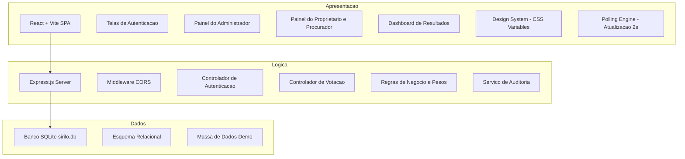

# Documento de Arquitetura de Software e Plano de Implementação - SIRILO v2.0

Este documento descreve a **arquitetura de software detalhada** e as **fases de implementação completas** do sistema **SIRILO (Sistema Interativo de Reunião e Integração Local)**. O objetivo é guiar o desenvolvimento do protótipo garantindo que todos os requisitos funcionais sejam implementados e que as telas funcionem perfeitamente durante a apresentação prática.

---

## 1. ARQUITETURA COMPLETA DO SISTEMA

A arquitetura do SIRILO foi concebida sob o padrão de **Três Camadas (Three-Tier Architecture)** combinado com o modelo **MVC (Model-View-Controller) Web**. Essa decisão garante uma separação clara entre a interface visual (Apresentação), as regras de negócio (Aplicação) e o armazenamento das informações (Persistência), permitindo que o sistema seja robusto e portátil.



### 1.1. Detalhamento da Camada de Apresentação (Frontend)
*   **Tecnologia:** React.js (inicializado com Vite).
*   **Design & Estilo:** Vanilla CSS baseado em variáveis globais (Cores HSL, gradientes sofisticados, sombras dinâmicas e transições suaves).
*   **Funcionalidades Específicas para Demonstração:**
    *   **Single-Page Navigation:** Navegação fluida para evitar recargas completas de página.
    *   **Motor de Polling (Tempo Real Simulado):** A tela de resultados consumirá a rota `/api/votacao/resultados` a cada 2 segundos via `setInterval` ou `requestAnimationFrame`. Isso garante que, quando um aluno votar de um celular, o gráfico no projetor atualize imediatamente.
    *   **Painel Admin com Controle de Sessão:** Botões claros para Abrir, Fechar e Resetar a votação.
    *   **Painel do Proprietário Responsivo:** Otimizado para visualização em smartphones.
    *   **Botão de Reset do Demo:** Botão exclusivo para o Administrador (ou rota oculta) que reconstrói o banco de dados com a massa de dados inicial (Seed), permitindo reiniciar a demonstração a qualquer momento.

### 1.2. Detalhamento da Camada de Lógica de Negócio (Backend)
*   **Tecnologia:** Node.js com Express.js.
*   **Segurança e Comunicação:**
    *   **Configuração de CORS:** Middleware CORS totalmente liberado para a rede local, permitindo que dispositivos externos (celulares dos avaliadores) façam requisições ao backend rodando no notebook principal.
    *   **Controle de Sessão e Auditoria (RF4):** Identificação e registro nos logs de auditoria do IP e do `User-Agent` do navegador que realizou cada voto e login.
*   **Regras de Negócio Implementadas:**
    *   **Unicidade do Voto (RF16, RF18):** Validação de que um proprietário ou seu procurador só pode votar uma vez por pauta.
    *   **Verificação de Adimplência (RF19):** Cruzamento do status de pagamento do proprietário. Proprietários adimplentes têm seus pesos normais somados. Proprietários inadimplentes podem ter o voto registrado com **peso zero** (ou bloqueado, dependendo da regra exata exigida).
    *   **Cálculo Ponderado (RF19):**
        *   Fração ideal de lote: Terreno = Peso 1.0.
        *   Fração ideal de lote: Casa construída = Peso 2.0.
        *   Inadimplente = Peso 0.0.

### 1.3. Detalhamento da Camada de Persistência (Banco de Dados)
*   **Tecnologia:** SQLite (baseado em arquivo físico `sirilo.db`).
*   **Esquema de Dados (Schema):**
    O banco de dados relacional é modelado em perfeita conformidade com o Diagrama de Classes Persistentes da página 26 do documento `ERSW_SIRILO_4`:
    *   `condominios` (id [PK], nome, cnpj)
    *   `proprietarios` (id [PK], condominio_id [FK], nome, email, senha, lotes [text], peso_voto [decimal], inadimplente [boolean], tipo_acesso [enum: Admin, Proprietario])
    *   `procuradores` (id [PK], proprietario_id [FK], reuniao_id [FK], nome, email, token_reuniao)
    *   `reunioes` (id [PK], condominio_id [FK], nome_assembleia, data, hora, status [enum: Agendada, Em_Andamento, Encerrada])
    *   `pautas` (id [PK], reuniao_id [FK], titulo, descricao, anexo_pdf [blob])
    *   `votacoes` (id [PK], reuniao_id [FK], pergunta, tipo_resposta [enum: Sim_Nao, Multipla_Escolha, Eleicao], visibilidade [enum: Aberta, Fechada], status [enum: Aguardando, Aberta, Encerrada], duracao_minutos)
    *   `votos` (id [PK], votacao_id [FK], proprietario_id [FK], procurador_id [FK, nullable], opcao_escolhida, peso_aplicado [decimal], timestamp, ip_voto)
    *   `logs_auditoria` (id [PK], usuario_id [FK], acao, data_hora, ip, navegador)

---

## 2. FASES COMPLETAS DE IMPLEMENTAÇÃO

O desenvolvimento do protótipo será dividido em **5 fases lógicas**, progredindo do ambiente e banco de dados até a simulação final da apresentação.

### FASE 1: Configuração do Ambiente e Inicialização (Setup)
*   **Objetivo:** Estruturar o projeto para execução simplificada e configurar o controle de dependências.
*   **Tarefas:**
    1.  Criar a pasta raiz do projeto com subpastas `backend` e `frontend`.
    2.  Configurar o `package.json` na raiz do projeto para utilizar o pacote `concurrently`. Adicionar o script:
        ```json
        "scripts": {
          "install-all": "npm install && cd backend && npm install && cd ../frontend && npm install",
          "dev": "concurrently \"npm run dev --prefix backend\" \"npm run dev --prefix frontend\""
        }
        ```
    3.  Inicializar o projeto Frontend utilizando Vite com React.
    4.  Inicializar o projeto Backend utilizando Node.js com Express e instalar as dependências do SQLite3 e Knex.js.

### FASE 2: Estrutura do Banco de Dados e Carga de Demonstração (Persistência)
*   **Objetivo:** Modelar as tabelas relacionais e garantir uma massa de dados pronta para a apresentação.
*   **Tarefas:**
    1.  Escrever os scripts de migração (`migrations`) do Knex para criação das 8 tabelas do banco de dados relacional em conformidade com o esquema acima.
    2.  Criar um script de **Seed** (`knex seed:run` ou script SQL) contendo:
        *   **1 Condomínio** cadastrado.
        *   **1 Administrador** cadastrado em `proprietarios` com `tipo_acesso = 'Admin'`.
        *   **Proprietário A:** Cadastrado com `lotes = 'Casa 10, Casa 11'`, `peso_voto = 4.0`, `inadimplente = false`.
        *   **Proprietário B:** Cadastrado com `lotes = 'Terreno 15'`, `peso_voto = 1.0`, `inadimplente = false`.
        *   **Proprietário C:** Cadastrado com `lotes = 'Casa 05'`, `peso_voto = 2.0`, `inadimplente = true` (para simular voto com peso zero).
        *   **Proprietário D:** Cadastrado com `lotes = 'Terreno 22'`, `peso_voto = 1.0`, `inadimplente = false` e com um **Procurador** associado para a Reunião.
        *   **1 Reunião cadastrada** no status `Em_Andamento` com **2 Pautas** e **1 Votação** pronta para ser aberta.
    3.  Criar uma rota backend oculta `/api/admin/reset-db` que apaga o arquivo `sirilo.db`, recria as tabelas e roda o script de seed instantaneamente.

### FASE 3: Desenvolvimento da Lógica de Negócio (Backend API)
*   **Objetivo:** Construir as APIs REST seguras e implementar as fórmulas de peso e auditoria.
*   **Tarefas:**
    1.  **API de Login (`/api/auth/login`):** Valida credenciais e retorna o perfil do usuário (Admin ou Proprietário) mais informações básicas de sessão, registrando o acesso no log de auditoria.
    2.  **API de Reuniões e Pautas (`/api/reunioes`):** Endpoints para visualizar pautas, baixar anexos (RF30) e gerenciar o status da reunião (RF9).
    3.  **API de Votação (`/api/votacoes`):** Endpoints para criar sessões de votação (RF14) e alterar seu status (Abrir/Fechar Votação - RF15).
    4.  **API de Voto (`/api/votacoes/votar`):**
        *   Recebe `proprietario_id`, `votacao_id` e a `opcao_escolhida`.
        *   Valida se a votação correspondente está ativa/aberta.
        *   Valida se o proprietário (ou procurador) já votou nesta votação (RF18).
        *   Busca o status do proprietário. Se `inadimplente = true`, o `peso_aplicado` será **0.0** (RF19). Caso contrário, usa o `peso_voto` do proprietário.
        *   Associa `procurador_id` caso a votação esteja sendo feita por um procurador cadastrado para aquela reunião (RF12).
        *   Captura o IP (`req.ip`) e o `User-Agent` da requisição para registrar na tabela de votos (`ip_voto`) e logs de auditoria (RF4).
        *   Salva o voto de forma definitiva e irreversível (RF18).
    5.  **API de Resultados (`/api/votacoes/resultados`):**
        *   Calcula a soma dos pesos de cada opção de voto para a votação ativa.
        *   Gera porcentagens relativas baseadas na soma dos pesos válidos registrados.
    6.  **API de Auditoria (`/api/auditoria`):** Retorna os registros de logs de auditoria para visualização do administrador.

### FASE 4: Criação das Telas e Estilização Premium (Frontend)
*   **Objetivo:** Desenvolver uma interface intuitiva, bonita, moderna e responsiva.
*   **Tarefas:**
    1.  **Criação do Design System:** Definir fontes modernas (como *Inter*), variáveis CSS para cores primárias/secundárias, gradientes suaves para fundos e efeitos de *glassmorphism* (cartões translúcidos).
    2.  **Tela de Login:** Formulário centralizado elegante com seleção rápida para "Entrar como Admin" ou "Entrar como Proprietário" (para acelerar os testes).
    3.  **Dashboard do Administrador:**
        *   Listagem de reuniões e pautas.
        *   Controles claros: botão "Iniciar Reunião" e botões "Abrir Votação" / "Encerrar Votação" em cada pauta.
        *   Seção de visualização do Log de Auditoria em formato de tabela elegante.
        *   Botão visível para Resetar Dados do Sistema.
    4.  **Painel do Proprietário / Procurador:**
        *   Exibição da pauta ativa. Se nenhuma votação estiver aberta, exibe mensagem amigável ("Aguardando início da votação").
        *   Interface de seleção do voto (opções com botões de rádio ou cartões clicáveis).
        *   Tela ou modal de confirmação do voto com resumo do peso que será aplicado.
        *   Mensagem de sucesso e impedimento visual caso tente votar novamente.
    5.  **Tela de Exibição de Resultados (Dashboard de Apresentação):**
        *   Gráfico em barras customizado em CSS puro ou biblioteca leve (ex: Recharts) mostrando a apuração.
        *   Integração do motor de Polling (recarga automática em segundo plano a cada 2s) com transições de CSS (`transition: width 0.5s ease-in-out`) para as barras de progresso crescerem de forma animada.

### FASE 5: Integração, Teste de Rede Local e Simulação
*   **Objetivo:** Garantir estabilidade total do sistema na hora da apresentação real do projeto.
*   **Tarefas:**
    1.  Testar exaustivamente as regras de validação (ex: garantir que o usuário inadimplente tenha peso 0 no resultado final).
    2.  Configurar a escuta do backend Express para todas as interfaces de rede (`app.listen(3000, '0.0.0.0')`) para habilitar o acesso externo na rede local.
    3.  Conectar um celular na mesma Wi-Fi do computador de desenvolvimento, acessar o frontend usando o IP da máquina e realizar o fluxo de login e voto completo.
    4.  Documentar no arquivo de roteiro de testes o passo a passo exato a ser seguido no dia da apresentação para que a banca veja todas as features funcionando sem interrupções.

---

## 3. ROTEIRO PARA APRESENTAÇÃO PERFEITA (PLAYBOOK DO DIA H)

Para maximizar o impacto visual das telas funcionando, o grupo deve seguir este roteiro de demonstração diante da banca avaliadora:

1.  **Preparação:**
    *   Notebook do apresentador conectado ao projetor mostrando duas abas do navegador lado a lado:
        *   *Aba 1 (Admin/Resultados):* Logado como Administrador na tela de resultados da pauta.
        *   *Aba 2 (Voto):* Tela de login do Proprietário.
    *   Um celular na mão de um dos integrantes do grupo logado como Proprietário Adimplente.
2.  **Passo 1 - Limpeza e Reset (Transparência):**
    *   O apresentador clica no botão "Resetar Banco" do Admin. Isso mostra que o banco é restaurado para o estado inicial padrão.
3.  **Passo 2 - Início da Votação (Fluxo de Criação):**
    *   O Administrador seleciona uma pauta (ex: "Aprovação de Orçamento da Pintura") e clica em **"Abrir Votação"**.
    *   Imediatamente, o celular do integrante (que estava aguardando) atualiza e exibe a pergunta e as opções de voto.
4.  **Passo 3 - Voto do Proprietário e Atualização Dinâmica:**
    *   O integrante vota "Sim" pelo celular.
    *   No projetor (Aba de Resultados), a barra de "Sim" cresce dinamicamente com uma animação fluida de CSS de 0% para 100% (com o peso adequado aplicado ao voto), demonstrando o funcionamento em tempo real.
5.  **Passo 4 - Validação de Inadimplência e Peso Zero:**
    *   Na Aba 2 do navegador (Notebook), o apresentador faz login como o **Proprietário Inadimplente** e vota "Não".
    *   No gráfico de resultados, o voto "Não" é registrado na lista de logs de auditoria, mas a barra de porcentagem do "Não" **não cresce** (ou cresce com peso zero), comprovando a validação em tempo real das regras de adimplência do sistema.
6.  **Passo 5 - Encerramento e Auditoria:**
    *   O Administrador clica em **"Encerrar Votação"**.
    *   O apresentador mostra a aba de **Log de Auditoria**, exibindo o histórico de acessos, logins e votos com os respectivos IPs locais e timestamps, validando os requisitos de conformidade técnica e segurança.
