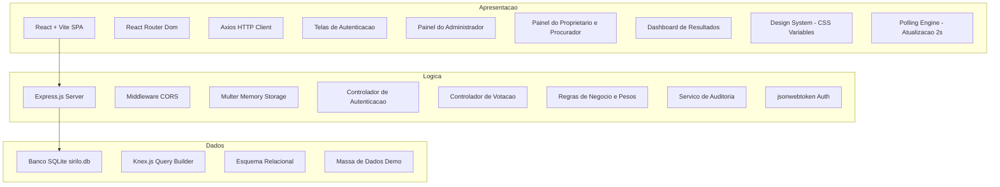

# Documento de Arquitetura de Software - SIRILO v2.0

Este documento descreve a **arquitetura de software detalhada** do sistema **SIRILO (Sistema Interativo de Reunião e Integração Local)**. O objetivo é guiar o desenvolvimento do protótipo garantindo que todos os requisitos funcionais sejam estruturados sob bases arquiteturais sólidas.

---

## 1. ARQUITETURA DO SISTEMA

A arquitetura do SIRILO foi concebida sob o padrão de **Três Camadas (Three-Tier Architecture)** combinado com o modelo **MVC (Model-View-Controller) Web**. Essa decisão garante uma separação clara entre a interface visual (Apresentação), as regras de negócio (Aplicação) e o armazenamento das informações (Persistência), permitindo que o sistema seja robusto e portátil.

### 1.1. Detalhamento da Camada de Apresentação (Frontend)
*   **Tecnologias Core:** React.js (v19) inicializado com Vite.
*   **Roteamento:** Client-side routing utilizando `react-router-dom` para viabilizar uma Single Page Application (SPA) fluida.
*   **Comunicação com a API:** `axios` para requisições HTTP assíncronas assinaladas com cabeçalhos de autenticação.
*   **Design & Estilo:** Vanilla CSS baseado em variáveis globais (Cores HSL, gradientes sofisticados, sombras dinâmicas e transições suaves).
*   **Funcionalidades Específicas para Demonstração:**
    *   **Single-Page Navigation:** Navegação fluida para evitar recargas completas de página.
    *   **Motor de Polling (Tempo Real Simulado):** A tela de resultados consumirá a rota `/api/votacao/resultados` a cada 2 segundos via `setInterval` ou `requestAnimationFrame`. Isso garante que, quando um usuário votar de um celular, o gráfico no projetor atualize imediatamente.
    *   **Painel Admin com Controle de Sessão:** Botões claros para Abrir, Fechar e Resetar a votação.
    *   **Painel do Proprietário Responsivo:** Otimizado para visualização em smartphones.
    *   **Botão de Reset do Demo:** Botão exclusivo para o Administrador (ou rota oculta) que reconstrói o banco de dados com a massa de dados inicial (Seed), permitindo reiniciar a demonstração a qualquer momento.

### 1.2. Detalhamento da Camada de Lógica de Negócio (Backend)
*   **Tecnologias Core:** Node.js com o framework Express.js.
*   **Segurança, Autenticação e Comunicação:**
    *   **Autenticação Stateless via JWT:** O sistema utiliza **JSON Web Tokens (JWT)** para autenticação stateless, garantindo que o backend não precise manter estados de sessão na memória ou banco.
        *   *Emissão no Login:* Cada vez que um usuário realiza o login com sucesso (Administrador, Proprietário ou Procurador), a API gera um token assinado criptograficamente.
        *   *Módulo de Serviço Dedicado:* A lógica de segurança dos tokens é encapsulada em um arquivo de serviço exclusivo: [jwt.service.js](file:///c:/Users/jciri/OneDrive/Desktop/6%20PERIODO/ENG%20SOFT/IMPLEMENTA%C3%87%C3%83O/backend/src/services/jwt.service.js). Esse arquivo define as funções:
            *   `emitirToken(payload)`: Cria e assina o token com uma chave secreta (`JWT_SECRET`) contendo o payload básico (perfil de acesso, `proprietario_id`, `procurador_id` e `reuniao_id`) com expiração definida para **8 horas** (cobria toda a sessão da assembleia).
            *   `verificarToken(token)`: Descriptografa e valida o token nas chamadas subsequentes.
    *   **Controle de Acesso por Middleware:** Middlewares específicos de autorização (`autenticar`, `apenasAdmin`, `apenasVotante`) interceptam as requisições protegidas, invocam a verificação do `jwt.service.js` para certificar que o token não foi adulterado, e injetam a identidade do usuário em `req.usuario` para uso seguro nas regras de negócio.
    *   **Upload de Arquivos:** Processamento de multipart/form-data via `multer` utilizando armazenamento em memória (`multer.memoryStorage()`) com limite estrito de 10MB por arquivo (utilizado para anexo de PDF de pautas).
    *   **Binding e Roteamento de Rede Seguro:** O frontend (Vite) é configurado para expor as portas para a rede local (`host: true`), enquanto o backend Express escuta apenas localmente em `localhost` (127.0.0.1). Todas as chamadas de API são encaminhadas internamente pelo Proxy Reverso do Vite. Isso blinda o backend de acessos diretos externos e simplifica configurações de firewall locais.
    *   **Controle de Sessão e Auditoria (RF4):** Identificação e registro nos logs de auditoria do IP e do `User-Agent` do navegador que realizou cada voto e login (incluindo proprietários e procuradores).
*   **Regras de Negócio Implementadas:**
    *   **Unicidade do Voto (RF16, RF18):** Validação de que um proprietário ou seu procurador só pode votar uma vez por pauta. Enforçado por restrição de banco no nível da tabela de votos.
    *   **Fluxo de Procurador Multi-Representante:** Cada procurador cadastrado possui um `token_reuniao` único. Caso um procurador represente mais de um proprietário, ele terá registros distintos e tokens separados para cada representação, realizando logins individuais e independentes para votar em nome de cada proprietário.
    *   **Verificação de Adimplência (RF19):** Cruzamento do status de pagamento do proprietário. Proprietários adimplentes têm seus pesos normais somados. Proprietários inadimplentes têm o voto registrado com **peso zero** (ou bloqueado, dependendo da regra exata exigida).
    *   **Cálculo Ponderado (RF19):**
        *   Fração ideal de lote: Terreno = Peso 1.0.
        *   Fração ideal de lote: Casa construída = Peso 2.0.
        *   Inadimplente = Peso 0.0.

### 1.3. Atores e Perfis de Acesso (RBAC)
Para garantir a segurança e a conformidade com as regras de negócio, o sistema possui três perfis de acesso bem definidos na camada de lógica e banco de dados:

*   **Administrador (Admin):**
    *   *Papel:* Organizador da assembleia (síndico ou administradora do condomínio).
    *   *Permissões:* Acesso a todas as funções gerenciais: criar pautas, fazer upload e exclusão de anexos em PDF, gerenciar sessões de votação (abrir/fechar), consultar logs de auditoria detalhados e resetar o banco de dados.
    *   *Restrições:* Bloqueado de emitir votos em qualquer votação.
*   **Proprietário:**
    *   *Papel:* Condômino titular de frações ideais no condomínio.
    *   *Permissões:* Logar no painel do eleitor usando e-mail/senha, visualizar pautas ativas e emitir seu voto ponderado.
    *   *Restrições:* Acesso restrito apenas ao painel do eleitor, sem permissão para ler logs ou gerenciar pautas/reuniões.
*   **Procurador:**
    *   *Papel:* Representante legal credenciado para votar em nome de um ou mais proprietários ausentes.
    *   *Permissões:* Acesso ao painel do eleitor autenticando-se por meio de um token de reunião único por representação. Permite realizar votos individuais em nome de cada proprietário que representa (logando separadamente para cada um, caso possua múltiplos tokens).
    *   *Restrições:* Sem privilégios administrativos.

#### Credenciais e Massa de Teste (Seed Demo)
Para viabilizar a homologação prática das permissões e das regras arquiteturais, a base de dados possui uma massa padrão configurada via sementes (seeds) com os seguintes acessos de teste:

| Perfil de Acesso | Credencial (E-mail ou Token) | Senha | Cenário de Teste / Regra de Negócio |
| :--- | :--- | :--- | :--- |
| **Administrador** | `admin@sirilo.com` | `admin123` | Permissões totais administrativas de controle (sem direito a voto). |
| **Proprietário A** | `proprietario_a@sirilo.com` | `senha123` | **Adimplente**. Possui 2 casas. Peso de voto: **4.0** (Cálculo Ponderado). |
| **Proprietário B** | `proprietario_b@sirilo.com` | `senha123` | **Adimplente**. Possui 1 terreno. Peso de voto: **1.0** (Cálculo Ponderado). |
| **Proprietário C** | `proprietario_c@sirilo.com` | `senha123` | **Inadimplente**. Possui 1 casa. Peso de voto: **0.0** (Regra de Adimplência - RF19). |
| **Procurador D** | `PROCURADOR_DEMO` *(Token)* | *N/A* | Representante do Proprietário D (Adimplente, Terreno, Peso **1.0**). |

### 1.4. Detalhamento da Camada de Persistência (Banco de Dados)
*   **Banco de Dados:** SQLite (baseado em arquivo físico `sirilo.db` ou `sirilo_test.db` para testes).
*   **Abstração e Query Builder:** Knex.js como interface de prevenção SQL, sendo também responsável pelo versionamento de banco via `migrations` e população inicial controlada via `seeds`.
*   **Esquema de Dados (Schema):**
    O banco de dados relacional é modelado em perfeita conformidade com o Diagrama de Classes Persistentes da página 26 do documento `ERSW_SIRILO_4`:
    *   `condominios` (id [PK], nome, cnpj)
    *   `proprietarios` (id [PK], condominio_id [FK], nome, email, senha, lotes [text], peso_voto [decimal], inadimplente [boolean], tipo_acesso [enum: Admin, Proprietario])
    *   `procuradores` (id [PK], proprietario_id [FK], reuniao_id [FK], nome, email, token_reuniao [UNIQUE])
    *   `reunioes` (id [PK], condominio_id [FK], nome_assembleia, data, hora, status [enum: Agendada, Em_Andamento, Encerrada])
    *   `pautas` (id [PK], reuniao_id [FK], titulo, descricao, anexo_pdf [blob])
    *   `votacoes` (id [PK], reuniao_id [FK], pauta_id [FK], pergunta, tipo_resposta [enum: Sim_Nao, Multipla_Escolha, Eleicao], visibilidade [enum: Aberta, Fechada], status [enum: Aguardando, Aberta, Encerrada], duracao_minutos)
    *   `votos` (id [PK], votacao_id [FK], proprietario_id [FK], procurador_id [FK, nullable], opcao_escolhida, peso_aplicado [decimal], timestamp, ip_voto) -> Com restrição UNIQUE em (votacao_id, proprietario_id) para garantir a unicidade do voto (RF18).
    *   `logs_auditoria` (id [PK], proprietario_id [FK, nullable], procurador_id [FK, nullable], acao, data_hora, ip, navegador)

### 1.5. Mapeamento de Rotas da API (Endpoints)
A comunicação entre a camada de apresentação e a camada de lógica é feita por meio de endpoints HTTP REST. A tabela abaixo lista os recursos expostos pela API sob o prefixo `/api`:

| Método | Endpoint | Acesso / Privilégio | Descrição |
| :--- | :--- | :--- | :--- |
| **POST** | `/api/auth/login` | Público | Autentica usuários (senha/email para Admin/Proprietário ou token para Procurador) e retorna o JWT. |
| **GET** | `/api/reunioes` | Autenticado | Lista todas as reuniões e pautas associadas. |
| **GET** | `/api/reunioes/:id` | Autenticado | Retorna os detalhes de uma reunião específica. |
| **PATCH** | `/api/reunioes/:id/status`| Apenas Admin | Atualiza o status da reunião (ex: muda para 'Encerrada', disparando fechamento em cascata). |
| **POST** | `/api/pautas` | Apenas Admin | Cria uma nova pauta para uma reunião. |
| **POST** | `/api/pautas/:id/anexo` | Apenas Admin | Faz o upload de anexo PDF para a pauta (via Multer). |
| **DELETE**| `/api/pautas/:id/anexo` | Apenas Admin | Exclui o anexo PDF de uma pauta. |
| **GET** | `/api/pautas/:id/anexo` | Autenticado | Baixa o arquivo PDF anexo de uma pauta específica. |
| **POST** | `/api/votacoes` | Apenas Admin | Cria uma nova sessão de votação para uma pauta. |
| **PATCH** | `/api/votacoes/:id/status`| Apenas Admin | Altera o status da votação (Abrir/Fechar votação). |
| **POST** | `/api/votacoes/votar` | Apenas Votante | Registra o voto calculando e validando o peso ponderado e a adimplência. |
| **GET** | `/api/votacoes/resultados` | Autenticado | Retorna a apuração ponderada de votos em tempo real da votação ativa. |
| **GET** | `/api/auditoria` | Apenas Admin | Lista todos os registros de logs de auditoria. |
| **POST** | `/api/admin/reset-db` | Apenas Admin (Chave) | Apaga o arquivo físico do banco sqlite e roda as seeds novamente (para reset do demo). |
| **GET** | `/api/status` | Público | Endpoint de status de monitoramento (health check). |

### 1.6. Requisitos Não-Funcionais (RNFs)
*   **Segurança (RNF-S):**
    *   *Autenticação Stateless:* Implementada usando JWT para evitar armazenamento de sessão no servidor.
    *   *Isolamento de API:* O backend Express está configurado para receber conexões exclusivamente no endereço local `127.0.0.1`, impossibilitando o acesso direto da rede externa sem passar pelo proxy reverso do Vite.
    *   *Princípio do Menor Privilégio:* Controle rígido de rotas por meio dos middlewares `apenasAdmin` e `apenasVotante` aplicados nos endpoints críticos.
*   **Desempenho e Concorrência (RNF-D):**
    *   *Async I/O:* O backend construído em Node.js é orientado a eventos e não bloqueante, otimizando o processamento concorrente de requisições durante picos de votação.
    *   *Tempo Real Otimizado:* Utilização de Polling HTTP curto (a cada 2 segundos) no frontend para apuração ágil do painel de resultados sem sobrecarregar a largura de banda.
*   **Usabilidade e Acessibilidade (RNF-U):**
    *   *Responsividade:* Interface desenvolvida com foco Mobile-First para garantir que os condôminos consigam votar confortavelmente utilizando smartphones na assembleia presencial.
    *   *Feedback Imediato:* Sistema de confirmação de votos e bloqueio visual de tela após votar para evitar tentativas acidentais de duplo voto.
*   **Portabilidade (RNF-P):**
    *   *Zero Setup de Infra:* O uso do banco de dados SQLite empacotado em arquivo físico (`sirilo.db`) elimina a necessidade de instalar e configurar um servidor SGBD (como Postgres/MySQL) na máquina onde a aplicação será demonstrada.

### 1.7. Qualidade e Testes
*   **Framework de Testes:** `jest` como test runner e biblioteca de asserções do backend.
*   **Testes de Integração de API:** `supertest` para simular chamadas HTTP aos endpoints do Express sem a necessidade de subir o servidor fisicamente em uma porta de rede, agilizando os testes automatizados da lógica de rotas.

### 1.8. Ferramental de Desenvolvimento (Developer Experience)
*   **Execução Concorrente:** `concurrently` para paralelizar a execução dos servidores de desenvolvimento frontend (Vite) e backend (Express) através de um único comando na raiz do projeto.
*   **Monitoramento de Arquivos:** `nodemon` para monitorar alterações nos arquivos de código do backend e reiniciar automaticamente o processo do servidor local.
*   **Linter Estático:** `oxlint` para linting de código extremamente rápido e eficiente, assegurando consistência e boas práticas no código JavaScript.
