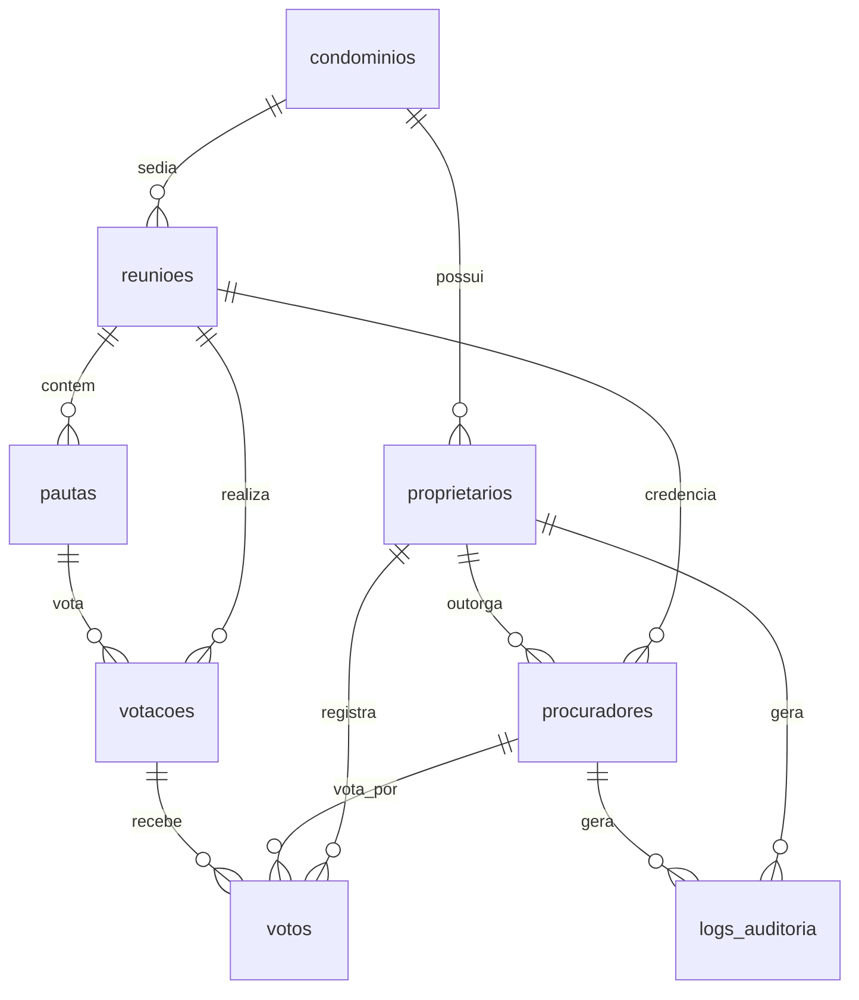

# Relacionamento de Tabelas - Banco de Dados SIRILO

Este documento detalha o modelo de dados do **SIRILO**, descrevendo as relações entre as 8 tabelas do banco de dados SQLite.

---

## 1. Diagrama de Entidade-Relacionamento (ERD)

Abaixo está a representação visual de como as tabelas estão interligadas:

---

## 2. Detalhamento das Relações

### 2.1. Condomínios e Proprietários (1:N)
*   **Tabelas**: `condominios` ➔ `proprietarios`
*   **Chave**: `proprietarios.condominio_id` refere-se a `condominios.id` (`ON DELETE CASCADE`).
*   **Regra**: Um condomínio possui múltiplos proprietários (ou administradores) cadastrados, mas cada proprietário pertence a apenas um condomínio.

### 2.2. Condomínios e Reuniões (1:N)
*   **Tabelas**: `condominios` ➔ `reunioes`
*   **Chave**: `reunioes.condominio_id` refere-se a `condominios.id` (`ON DELETE CASCADE`).
*   **Regra**: Um condomínio pode realizar diversas reuniões/assembleias ao longo do tempo.

### 2.3. Reuniões, Proprietários e Procuradores (N:M via tabela de ligação)
*   **Tabelas**: `proprietarios` + `reunioes` ➔ `procuradores`
*   **Chaves**: 
    *   `procuradores.proprietario_id` refere-se a `proprietarios.id` (`ON DELETE CASCADE`).
    *   `procuradores.reuniao_id` refere-se a `reunioes.id` (`ON DELETE CASCADE`).
*   **Regra**: Um procurador representa um proprietário específico durante uma reunião específica. O acesso é feito via `token_reuniao` exclusivo.

### 2.4. Reuniões e Pautas (1:N)
*   **Tabelas**: `reunioes` ➔ `pautas`
*   **Chave**: `pautas.reuniao_id` refere-se a `reunioes.id` (`ON DELETE CASCADE`).
*   **Regra**: Uma assembleia/reunião é composta por várias pautas (assuntos a serem discutidos e votados).

### 2.5. Pautas e Votações (1:1 / 1:N)
*   **Tabelas**: `pautas` ➔ `votacoes`
*   **Chave**: `votacoes.pauta_id` refere-se a `pautas.id` (`ON DELETE CASCADE`).
*   **Regra**: Cada pauta pode dar origem a uma votação para decidir sobre a aprovação ou rejeição daquele assunto.

### 2.6. Votações e Votos (1:N)
*   **Tabelas**: `votacoes` ➔ `votos`
*   **Chave**: `votos.votacao_id` refere-se a `votacoes.id` (`ON DELETE CASCADE`).
*   **Regra**: Uma votação pode receber múltiplos votos dos proprietários/procuradores habilitados.

### 2.7. Proprietários, Procuradores e Votos
*   **Tabelas**: `proprietarios` ➔ `votos` ➔ `procuradores`
*   **Chaves**:
    *   `votos.proprietario_id` refere-se a `proprietarios.id` (`ON DELETE CASCADE`).
    *   `votos.procurador_id` refere-se a `procuradores.id` (`ON DELETE SET NULL`, aceita nulo).
*   **Regras de Negócio**:
    *   **RF18 (Voto Único)**: Garantido pela restrição `UNIQUE(votacao_id, proprietario_id)`.
    *   **RF12 (Auditoria)**: Se o proprietário votar diretamente, `procurador_id` fica `null`. Se for por procurador, o ID do procurador é registrado na coluna.

### 2.8. Logs de Auditoria
*   **Tabelas**: `logs_auditoria` ➔ `proprietarios` / `procuradores`
*   **Chaves**:
    *   `logs_auditoria.proprietario_id` refere-se a `proprietarios.id` (`ON DELETE SET NULL`).
    *   `logs_auditoria.procurador_id` refere-se a `procuradores.id` (`ON DELETE SET NULL`).
*   **Regra**: Registra as ações cruciais (login, voto computado, etc.) contendo IP e navegador para fins de transparência.
